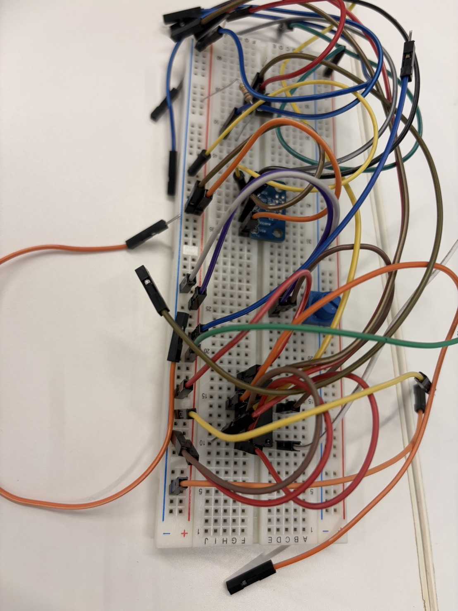

# rpi_sensors


**Raspberry Pi に接続した各種センサー（温湿度・気圧・CO2・照度・アナログ入力など）を、数行のコードで読み取れる Python ライブラリです。**
オブジェクト指向で設計しているので、センサーが変わっても同じ書き方でデータを取得できます。

<!-- ↓ 実機の写真や、取得データのグラフ画像を入れると一気に伝わります -->


## ✨ 特徴

- 🧩 **主要センサーに対応** — BME280 / DHT22 / MH-Z19C(CO2) / MCP3208(ADC) など
- 🪶 **数行で読み取り** — 面倒な初期化やプロトコル処理は内部で吸収
- 🔁 **統一インターフェース** — 複数のセンサーを同じ書き方で扱える
- 🪪 **MIT ライセンス** — 自由に利用・改変できます

## 📈 こんなことができます

- 室内の温度・湿度・CO2 を定期的に記録（CSVログ）
- 取得データのグラフ化（温度推移の可視化）
- 自作IoT・研究・実験のデータ収集基盤として

Raspberry Piに接続された各種センサーやアナログ入出力（ADC）モジュールを、オブジェクト指向でクリーンかつ簡単に操作するためのPythonライブラリです。

チャタリング対策済みの物理ボタン、SPI経由のA/Dコンバータ（MCP3208）を用いたアナログセンサー（照度・音・ジョイスティック・半固定抵抗）、I2C接続の温湿度・気圧センサー（BME280）、GPIO直接駆動の温湿度センサー（DHT22）、UART接続のCO2センサー（MH-Z19C）に幅広く対応しています。環境データの取得からMariaDB等へのロギングといった、IoTシステム開発のベースとして最適です。

---

## 1. 前提条件とハードウェア接続

本ライブラリを使用する前に、Raspberry Pi側で **SPI**, **I2C**, **Serial Port (UART)** が有効化されていることを確認してください（`sudo raspi-config` の `Interface Options` から設定可能）。

### 🔌 ハードウェア接続の標準構成

各モジュール・サンプルのデフォルトのピン配置および接続方法は以下の通りです。

#### 1. SPI通信 (MCP3208 経由のアナログ入力)
MCP3208はRaspberry Piの標準SPIピン（SPI0）に接続します。
* **VREF / VDD**: 3.3V
* **AGND / DGND**: GND
* **CLK**: GPIO 11 (SCLK)
* **DOUT**: GPIO 9 (MISO)
* **DIN**: GPIO 10 (MOSI)
* **CS/SHDN**: GPIO 8 (CE0)

| MCP3208 チャンネル | 対象モジュール / センサー | 該当クラス |
| :--- | :--- | :--- |
| **CH0** | Grove 照度センサー | `GroveLightSensor` |
| **CH1** | Grove サウンドセンサー | `GroveSoundSensor` |
| **CH2** | 半固定抵抗 (ポテンショメータ) | `PotentiometerMCP3208` |
| **CH0 / CH1** (別構成例) | アナログジョイスティック (X軸 / Y軸) | `JoystickMCP3208` |

#### 2. その他のセンサー・コンポーネント (GPIO / I2C / UART)

| センサー名 | 通信規格 | Raspberry Pi 接続ピン (デフォルト) | 該当クラス |
| :--- | :--- | :--- | :--- |
| **BME280** | I2C | GPIO 2 (SDA) / GPIO 3 (SCL) <br>※I2Cアドレス: `0x76` (または `0x77`) | `BME280Sensor` |
| **DHT22** | デジタル単線 | **GPIO 26** | `DHT22` |
| **MH-Z19C** | UART (シリアル) | GPIO 14 (TXD) / GPIO 15 (RXD) <br>※デバイスファイル: `/dev/serial0` | `MHZ19C` |
| **タクタイルボタン** | デジタル入力 | **GPIO 17** (内蔵プルアップ使用、GND接続) | `TactileButton` |

---

## 2. インストール方法

### 📦 リモート（GitHub）からの直接インストール
GitHubリポジトリから直接 `pip` を使用して、依存関係（`lgpio`, `spidev`, `smbus2`, `RPi.bme280`, `pyserial`）ごと一括インストールします。

```bash
pip install git+https://github.com/Kazuki1729/rpi-sensor-lib.git(https://github.com/kazuki1729/rpi-sensor-lib.git)

## 3. 使い方（クイックスタート）

すべてのクラスは `with` 文に対応しており、ブロックを抜けると自動で `close()` されます。

### 照度 / サウンドセンサー（Grove + MCP3208）
```python
from rpi_sensors import GroveLightSensor, GroveSoundSensor

with GroveLightSensor(channel=0) as light, GroveSoundSensor(channel=1) as sound:
    print(light.read_raw())      # 0〜4095 の生値
    print(light.read_voltage())  # 電圧(V)
    print(light.read_ratio())    # 0.0〜1.0
    print(sound.read_raw())
```

### ジョイスティック（MCP3208）
```python
from rpi_sensors import JoystickMCP3208

with JoystickMCP3208(deadzone=150) as joy:
    x, y = joy.read_xy(ch_x=2, ch_y=3, normalize=True)  # -1.0〜1.0
    print(x, y)
```

### 半固定抵抗（ポテンショメータ）
```python
from rpi_sensors import PotentiometerMCP3208

with PotentiometerMCP3208(channel=4) as pot:
    print(pot.read_percentage())  # 0.0〜100.0 %
    print(pot.read_angle())       # 0〜300 度
```

### 温湿度・気圧（BME280 / I2C）
```python
from rpi_sensors import BME280Sensor

with BME280Sensor(port=1, address=0x76) as bme:
    temp, hum, pres = bme.read()  # ℃, %, hPa
    print(temp, hum, pres)
```

### 温湿度（DHT22 / GPIO）
```python
from rpi_sensors import RobustDHT22, DHT22ReadError

with RobustDHT22(pin=26) as dht:
    try:
        temp, hum = dht.read()  # 自動リトライ＋2秒キャッシュ
        print(temp, hum)
    except DHT22ReadError as e:
        print("読み取り失敗:", e)
```

### CO2センサー（MH-Z19C / UART）
```python
from rpi_sensors import MHZ19C

with MHZ19C(serial_device='/dev/serial0') as co2:
    ppm = co2.read_co2()  # int(ppm) または None
    print(ppm)
```

### タクタイルボタン（GPIO・チャタリング対策＆長押し計測）
```python
import time
from rpi_sensors import TactileButton

with TactileButton(pin=17) as btn:
    while True:
        just_pressed, released_duration, held_time = btn.update()
        if just_pressed:
            print("押下！")
        time.sleep(0.01)
```

---

## 4. APIリファレンス

| クラス | コンストラクタ（主な引数） | 主なメソッド | 戻り値 |
| :--- | :--- | :--- | :--- |
| `GroveLightSensor` / `GroveSoundSensor` | `channel, vref=3.3` | `read_raw()` / `read_voltage()` / `read_ratio()` | `int` / `float` / `float` |
| `JoystickMCP3208` | `deadzone=150` | `read_xy(ch_x, ch_y, normalize=False)` | `(x, y)` タプル |
| `PotentiometerMCP3208` | `channel, vref=3.3, interval_sec=0.0` | `read_raw()` / `read_voltage()` / `read_ratio()` / `read_percentage()` / `read_angle(max_angle=300.0)` | `int` / `float` |
| `BME280Sensor` | `port=1, address=0x76` | `read()` | `(temp, hum, pres)` |
| `RobustDHT22` | `pin=26, max_retries=5, read_interval=2.0` | `read()`（失敗時 `DHT22ReadError`） | `(temp, hum)` |
| `MHZ19C` | `serial_device='/dev/serial0', baudrate=9600` | `read_co2()` | `int(ppm)` または `None` |
| `TactileButton` | `pin, debounce_time=0.05` | `update()` | `(just_pressed, released_duration, held_time)` |

> すべてのクラスは `with` 文（コンテキストマネージャ）対応。明示的に閉じる場合は `.close()` を呼んでください。
